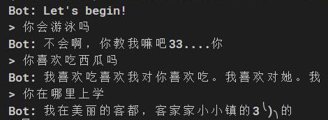

# ChattingBot 实验报告

[这是我们的github仓库](https://github.com/Kimagure7/ChattingBot)

<!-- @import "[TOC]" {cmd="toc" depthFrom=1 depthTo=6 orderedList=false} -->

<!-- code_chunk_output -->

- [ChattingBot 实验报告](#chattingbot-实验报告)
  - [组员](#组员)
  - [代码结构](#代码结构)
  - [基于字符串匹配的basic部分](#基于字符串匹配的basic部分)
    - [基于字符串匹配的基础I/O](#基于字符串匹配的基础io)
    - [Windows系统下的气泡设计与基于问答的api调用](#windows系统下的气泡设计与基于问答的api调用)
    - [Windows系统下将输入转为utf-8编码的功能](#windows系统下将输入转为utf-8编码的功能)
  - [基于Pytorch的深度学习部分](#基于pytorch的深度学习部分)
    - [了解深度学习原理及Seq2Seq模型](#了解深度学习原理及seq2seq模型)
    - [英文聊天机器人](#英文聊天机器人)
      - [环境搭建](#环境搭建)
      - [训练集处理](#训练集处理)
      - [模型构建](#模型构建)
      - [定义训练过程](#定义训练过程)
    - [中文聊天机器人](#中文聊天机器人)
      - [分词](#分词)
      - [数据处理](#数据处理)
    - [不同训练集](#不同训练集)
      - [英文电影对话](#英文电影对话)
      - [青云语料](#青云语料)
      - [自己处理的小说对话](#自己处理的小说对话)
  - [基于调用api的api部分](#基于调用api的api部分)
  - [GUI界面](#gui界面)
    - [按钮位置定义](#按钮位置定义)
    - [菜单栏定义](#菜单栏定义)
    - [按钮名字、提示符、快捷键定义](#按钮名字-提示符-快捷键定义)
    - [按钮事件定义](#按钮事件定义)
    - [其他修改](#其他修改)
  - [html界面](#html界面)
    - [前端部分](#前端部分)
    - [后端部分](#后端部分)

<!-- /code_chunk_output -->


## 组员

- 马俊杰        (Mahiru)
  - 完成html前端设计及其python后端设计
  - 完成api调用模块
- 杨涛          (MomoTori)
    - 实现英文聊天机器人
    - 实现中文聊天机器人
    - 尝试不同的中文训练集
- 殷尘龙        (ustchunzi)
  - 完成基于字符串匹配的基础I/O
  -	完成Windows系统下的气泡设计与基于问答的api调用
  -	完成Windows系统下将输入转为utf-8编码的功能

- 赵子毅        (Kimagure)
  - 独立完成GUI界面
  - 修改Pytorch模块接口 使其能被GUI调用
  - 参与学习Pytorch原理

## 代码结构

1. basic部分
   1. linux_robot.c对应linux终端下运行的基础部分
   2. robot.c是做了转码处理的linux——robot.c 但转码部分已被注释
2. pytorch部分
   1. Ctalk和Etalk分别对应中英文对话 talk函数 一问一答
   2. 两个train则是对语料集进行训练然后将结果暂存供talk读取
   3. header是他们的公共头文件
3. api
   1. bot.py就是
4. html
   1. index.html + resource构成网页主题
   2. backen.py实现网页后端功能

## 基于字符串匹配的basic部分

### 基于字符串匹配的基础I/O

实现的基本思路是基于关键词的字符串匹配，如果找到关键词，便输出对应的答复，这样即可以提高编程效率，又能做到对正常问答的尽可能匹配。
用于匹配的函数如下


其功能类似c++ string类里的find函数。
之后便进行匹配来确定输出内容，例如下面的代码


测试结果如下


其余的匹配结果也基本如此，此外两个关键点
其一是如果没有任何匹配结果，则会在以下三个答复里随机选择一个


其二是如果需要结束对话，需要匹配到以下的字符串


### Windows系统下的气泡设计与基于问答的api调用

设计思路来源于上学期数据结构大作业中电梯模拟的可视化
先创建标准输出句柄，再设计各个部分的字体颜色


控制台字体为黄色（红+绿），机器人字体为绿色，用户字体为青色（绿+兰），并且都高亮显示。机器人气泡的COMMON_LVB_GRID_HORIZONTAL参数将输出控制为顶部水平网络格式。

此外，借助Windows.h的system函数，可以让I/O的部分功能更完善，如下


这个part便可以随机在三个网页里打开一个


再比如这里，可以直接打开Windows自带的计算器，其它部分也是同理。

### Windows系统下将输入转为utf-8编码的功能

完成最后一个功能纯属无奈，因为Windows的shell默认输入均为GB2312编码，但是实验的环境为utf-8，所以经过在GitHub上学习，设计了以下部分


该部分可以顺利把GB2312转换为utf-8，在Windows环境时可以使用

## 基于Pytorch的深度学习部分

### 了解深度学习原理及Seq2Seq模型

笔者主要通过3B1B的视频讲解来了解深度学习原理([中文翻译频道](https://space.bilibili.com/88461692/search/video?keyword=%E5%AD%A6%E4%B9%A0))，从中了解了深度学习的过程大致如下：

- 分析应用场景，并根据场景构建合适的模型
- 设计训练过程，根据误差进行反向传播，更新参数
- 进行训练
- 测试训练成果

而聊天机器人常用的模型为Seq2Seq模型，将可变长度序列作为输入，并使用固定大小的模型将可变长度序列作为输出返回。

### 英文聊天机器人

因为能力限制，主要参考下面的教程来搭建机器人，并且理解并不一定符合事实，希望助教见谅

英文：https://pytorch.org/tutorials/beginner/chatbot_tutorial.html

中文翻译：https://tanbro.github.io/pytorch-tutorials-notebooks-zhs/beginner/chatbot_tutorial

该教程包含了数据处理、模型构建、训练定义以及模型的运行，在阅读代码之后将各个模块分块，可以得到 train 和 talk 两个部分，分别对应训练模型和运行训练好的模型

#### 环境搭建

需要安装CUDA和pytorch库（和一块GPU）

#### 训练集处理

训练集的格式为：

```
a b c \t e f g
a b c \t e f g
```

通过空格` `进行词的区分，并且通过转移符号`\t`区分问题与回复，每一行为一个问答

程序将文件读入后，建立一个`Voc`类来对每个词汇进行索引，这样就将词汇映射为索引值，这样就能够转化为 `pytorch` 能够处理的张量形式

#### 模型构建

教程中的大致模型如下


同时，`encoder` 和 `decoder` 中的单向 `GUR` 改用双向 `GUR` ，可以直接调用 `pytorch` 的 `nn.GRU` 组件实现，并且在 `decoder` 中使用“注意力机制”，允许解码器只关注输入序列的某些部分，以提高输出的准确率


#### 定义训练过程

因为输入进行了批量填充，所以损失函数需要根据损失掩码计算对应于掩码向量中1的元素的负对数相似度

```py
def maskNLLLoss(inp, target, mask):
    nTotal = mask.sum()
    crossEntropy = -torch.log(torch.gather(inp, 1, target.view(-1, 1)).squeeze(1))
    loss = crossEntropy.masked_select(mask).mean()
    loss = loss.to(device)
    return loss, nTotal.item()
```

在定义了损失函数之后，就可以用 `pytorch` 的函数进行反向传播调整参数

### 中文聊天机器人

#### 分词

考虑到英文自带空格进行词汇的划分，如果要实现中文聊天机器人，则首先需要做中文的划分

在这里的解决方法是调用 `jieba` 库来进行分词，并在词语中间插入空格实现原英文机器人空格分词的效果，具体实现为

```py
str=' '.join(jieba.cut(s, cut_all=True))
```

#### 数据处理

以从小说中截取对话为例，日本轻小说以符号 `「` 作为对话的开头，为了截取对话需要探测两行都是以 `「` 开头的文段，并将其截取下来处理为 `a \t b`的形式，处理如下

```py
line1=""
line2=""
lineList=[]

def dataProcessing(fileName):
    with open(fileName,"r",encoding="utf=8") as input:
        while True:
            line1=input.readline()  # 带有'\n'
            if line1=="":           
                break               # 文件结束
            line1=line1.strip()
            if line1=="":
                continue
            if line1[0]=="「":
                line2=input.readline()  # 匹配第二个"「"
                if line2=="":
                    break
                line2=line2.strip()
                if line2=="":
                    continue
                if line2[0]=="「":
                    line1=line1[1:-1]
                    line2=line2[1:-1]
                    lineList.append(line1.strip()+"\t"+line2.strip())

    with open("de"+fileName,"w",encoding="utf=8") as out:
        for line in lineList:
            out.write(line+"\n")
```

之后调整 `train.py` 中文件编码格式、字符处理等一些细节就可以开始训练中文聊天机器人了

### 不同训练集

#### 英文电影对话

原教程所用的训练集，可以看出基本有些许智能


#### 青云语料

来自于某聊天机器人交流群，对话较为生活化，因此效果较好

在这里截取一些比较正常的回复，但虽然勉强可以看懂回复的意思，回复的噪音依然很大，带有许多乱码以及不符合中文语法的句子



#### 自己处理的小说对话

因为训练集大部分截取自奇幻小说，和剧情的关系性很强，这就导致了用日常对话来输入基本无法得到想要的结果，而且回复的基本都是某些前后连贯性和剧情性很强的连句


## 基于调用api的api部分

本部分基于API图灵机器人，利用requests和json库实现API交互

图灵机器人介绍如下：

[新建标签页 (tuling123.com)](http://tuling123.com/help/h_cent_webapi.jhtml)

核心代码如下：

```python
#
# @Author: Mahiru
# @Date: 2022-04-24 10:16:47
# @LastEditors: Mahiru
# @LastEditTime: 2022-04-24 16:18:25
# @FilePath: /ChattingBot/api/bot.py
# @Description: 
# Copyright (c) 2022 by Mahiru, All Rights Reserved. 
#

import json
import requests
API_URL = 'http://openapi.turingapi.com/openapi/api/v2'
KEY = 'c70f2778ff35474e93cb8b11195030d0'

def chat(text: str, user: str) -> str:
    data = {
        'perception': {
            'inputText': {'text': text}
        },
        'userInfo': {
            'apiKey': KEY, 'userId': user
        }
    }
    raw = requests.post(API_URL,json.dumps(data))
    records = json.loads(raw.text)['results']  # 得到API返回的一条条回复
    # print(records)
    ans = ''  # 最终的结果

    for record in records:
        restype = record['resultType']
        resval = record['values'][restype]
        if restype == 'url' or restype == 'text':
            ans += resval+'\n'
        else:
            pass  # 或许可以加点功能
    return ans


if __name__ == '__main__':
    while True:
        text = input('input message: ')
        print(chat(text, 'me'))

```

讲解已在注释给出，不在赘述

## GUI界面

基于Pyqt6开发


包含两个按钮、发送框、接受框、模式选择菜单

### 按钮位置定义

如代码所示 分别定义各个按钮和文本框位置

line为两个对话框中间的分割线

同时设置提示消息（鼠标放置于按钮上时的提示信息）以及快捷键

```py
# 主窗口
        ChattingBot.setObjectName("ChattingBot")
        ChattingBot.resize(800, 600)
        self.centralwidget = QtWidgets.QWidget(ChattingBot)
        self.centralwidget.setObjectName("centralwidget")

        self.Enter = QtWidgets.QPushButton(self.centralwidget)
        self.Enter.setGeometry(QtCore.QRect(457, 440, 81, 24))
        self.Enter.setObjectName("Enter")
        self.Enter.setStatusTip('快捷键为Ctrl+Enter')
        self.OutputText = QtWidgets.QTextBrowser(self.centralwidget)
        self.OutputText.setGeometry(QtCore.QRect(71, 41, 471, 291))
        self.OutputText.setObjectName("OutputText")

        self.InputText = QtWidgets.QTextEdit(self.centralwidget)
        self.InputText.setGeometry(QtCore.QRect(70, 350, 471, 81))
        self.InputText.setObjectName("InputText")

        self.line = QtWidgets.QFrame(self.centralwidget)
        self.line.setGeometry(QtCore.QRect(70, 330, 471, 21))
        self.line.setFrameShape(QtWidgets.QFrame.Shape.HLine)
        self.line.setFrameShadow(QtWidgets.QFrame.Shadow.Sunken)
        self.line.setObjectName("line")

        self.close = QtWidgets.QPushButton(self.centralwidget)
        self.close.setGeometry(QtCore.QRect(370, 440, 75, 24))
        self.close.setObjectName("close")
        self.close.setStatusTip('快捷键为Ctrl+Q')

        ChattingBot.setCentralWidget(self.centralwidget)
```

### 菜单栏定义

1. 0级和1级菜单

```py
# 模式选择组件

        self.menubar = QtWidgets.QMenuBar(ChattingBot)
        self.menubar.setGeometry(QtCore.QRect(0, 0, 800, 22))
        self.menubar.setObjectName("menubar")
        self.options = QtWidgets.QMenu(self.menubar)
        self.options.setObjectName("settings")
        self.mode = QtWidgets.QMenu(self.options)
        self.mode.setObjectName("mode")
        ChattingBot.setMenuBar(self.menubar)
        self.statusbar = QtWidgets.QStatusBar(ChattingBot)
        self.statusbar.setObjectName("statusbar")
        ChattingBot.setStatusBar(self.statusbar)
```

2. 2级菜单

```py
# 三大模式
        # 默认是dl模式
        self.basic = QtGui.QAction(ChattingBot)
        self.basic.setCheckable(True)
        self.basic.setChecked(False)
        self.basic.setObjectName("basic")
        self.basic.setStatusTip('基于字符串匹配实现')
        self.DeepLearning = QtGui.QAction(ChattingBot)
        self.DeepLearning.setCheckable(True)
        self.DeepLearning.setChecked(True)
        self.DeepLearning.setObjectName("DeepLearning")
        self.DeepLearning.setStatusTip('基于Pytorch实现')
        self.api = QtGui.QAction(ChattingBot)
        self.api.setCheckable(True)
        self.api.setChecked(False)
        self.api.setObjectName("API")
        self.mode.addAction(self.basic)
        self.mode.addAction(self.DeepLearning)
        self.mode.addAction(self.api)
        self.options.addAction(self.mode.menuAction())
        self.menubar.addAction(self.options.menuAction())
```

### 按钮名字、提示符、快捷键定义

1. setText为按钮上显示的字符串
2. setTitle为菜单上显示的字符串
3. setToolTip为鼠标放在模式选择上的时候，左下角出现的提示信息（按钮的提示在前面）
```py
def retranslateUi(self, ChattingBot):
        """负责标签名字"""
        _translate = QtCore.QCoreApplication.translate
        ChattingBot.setWindowTitle(_translate("ChattingBot", "MainWindow"))
        self.Enter.setText(_translate("ChattingBot", "发送"))
        self.Enter.setShortcut(_translate("ChattingBot", "Ctrl+Return"))
        self.close.setText(_translate("ChattingBot", "关闭"))
        self.close.setShortcut(_translate("ChattingBot", "Ctrl+Q"))
        self.options.setTitle(_translate("ChattingBot", "settings"))
        self.mode.setTitle(_translate("ChattingBot", "mode"))
        self.basic.setText(_translate("ChattingBot", "basic"))
        self.basic.setToolTip(_translate("ChattingBot", "基于字符串匹配实现"))
        self.DeepLearning.setText(_translate("ChattingBot", "DeepLearning"))
        self.DeepLearning.setToolTip(_translate("ChattingBot", "基于Pytorch实现"))
        self.api.setText(_translate("ChattingBot", "api"))
        self.api.setToolTip(_translate("ChattingBot", "基于API调用实现"))
```

### 按钮事件定义


需要注意 传递参数必须使用lambda隐式函数传递 不然无法成功传递
```py
 self.retranslateUi(ChattingBot)
        # 按钮事件定义
        # self.Enter.clicked['bool'].connect(lambda: self.buttonClicked(ChattingBot))
        self.Enter.clicked['bool'].connect(self.chatting)
        self.Enter.clicked['bool'].connect(self.InputText.clear)
        self.close.clicked['bool'].connect(ChattingBot.close)  # 直接关闭当前窗口
        # 按下后保证只有一个按钮亮起
        self.basic.triggered.connect(lambda: self.mode_select(ChattingBot))
        self.DeepLearning.triggered.connect(lambda: self.mode_select(ChattingBot))
        self.api.triggered.connect(lambda: self.mode_select(ChattingBot))
        # QtCore.QMetaObject.connectSlotsByName(ChattingBot)
```

### 其他修改

由于GUI界面为最终对话的界面 所以需要做出一些修改

- 确保只有一个模式启用
```py
  def mode_select(self, ChattingBot):
        """选择模式时确保只有一个模式在使用"""
        sender = ChattingBot.sender()
        if sender == self.basic:
            if not self.basic.isChecked():  # 把唯一一个亮着的按了下去
                self.basic.setChecked(True)
            else:
                self.DeepLearning.setChecked(False)
                self.api.setChecked(False)
        if sender == self.DeepLearning:
            if not self.DeepLearning.isChecked():  # 把唯一一个亮着的按了下去
                self.DeepLearning.setChecked(True)
            else:
                self.basic.setChecked(False)
                self.api.setChecked(False)
        if sender == self.api:
            if not self.api.isChecked():  # 把唯一一个亮着的按了下去
                self.api.setChecked(True)
            else:
                self.basic.setChecked(False)
                self.DeepLearning.setChecked(False)
```

- 状态获取
  ```py
  def getState(self) -> int:
        if self.api.isChecked():
            return 3
        if self.DeepLearning.isChecked():
            return 2
        if self.basic.isChecked():
            return 1
  ```

- 对话
  ```python
  def chatting(self):
        """作用是发送input的文本到其他模块"""
        content = self.InputText.toPlainText()
        # TODO： 接入其他模块以完成最终通信
        state = self.getState()
        result = ''
        if state == 1:
            self.OutputText.setText('由于编码问题 该模块不可用')
            return
        if state == 2:
            if is_en(content[0]):
                result = DLEChat(content)
            else:
                result = DLCChat(content)
        if state == 3:
            result = apiChat(content)
  
        ans = 'You:' + content + '\nBot:' + result  # ans为最终回复
        self.OutputText.setText(ans)
  
  def apiChat(x: str) -> str:
      return bot.chat(x, 'me')
  
  def DLEChat(x: str) -> str:
      """英文版深度学习"""
      return Etalk.talk(x)
  
  def DLCChat(x: str) -> str:
      """中文版深度学习"""
      return Ctalk.talk(x)
  
  def is_en(w) -> bool:
      if 'a' <= w <= 'z' or 'A' <= w <= 'Z':
          return True
      else:
          return False
  ```
  效果展示:
  

## html界面

### 前端部分

```html
<!DOCTYPE html>
<html>

<head>
    <link href="resource/css.css" rel="stylesheet">
    <!-- <link href="resource/materialdesignicons.min.css" rel="stylesheet"> -->
    <link href="resource/vuetify.min.css" rel="stylesheet">
    <meta name="viewport" content="width=device-width, initial-scale=1, maximum-scale=1, user-scalable=no, minimal-ui">
</head>

<body>
    <div id="app">
        <v-app>
            <v-main>
                <v-container fluid class="pa-0">
                    <v-row class="text-center">
                        <v-col class="my-12" cols="12">
                            <!-- 标题 -->
                            <h1 class="display-2 font-weight-bold my-6 lime--text text--lighten-5">Chatbot</h1>
                        </v-col>
                    </v-row>
                    <v-row>
                        <v-col cols="3"></v-col>
                        <v-col cols="6" sm="6" justify="center">
                            <v-card class="mx-auto">
                                <v-container>

                                    <!-- 模式选择 -->
                                    <v-select :items="items" v-model="mode" label="Mode"></v-select>

                                    <!-- 文本输入 -->
                                    <v-textarea v-model="msg" clearable clear-icon="mdi-close-circle"
                                        label="Input text here">
                                    </v-textarea>

                                    <!-- 发送按钮 -->
                                    <v-card-actions>
                                        <v-btn color="deep-purple lighten-2" text @click="send">
                                            Send
                                        </v-btn>
                                    </v-card-actions>


                                </v-container>
                            </v-card>
                        </v-col>
                        <v-col cols="3"></v-col>
                    </v-row>

                    <!-- 机器人回复，初始状况下不显示 -->
                    <v-row v-if="show_response">
                        <v-col cols="3"></v-col>
                        <v-col cols="6" sm="6" justify="center">
                            <v-card class="mx-auto">
                                <v-card-text class="pb-0">


                                    <!-- 机器人回复 -->
                                    <p class="subtitle-1">
                                        {{response}}
                                    </p>

                                </v-card-text>
                                <br>
                            </v-card>
                        </v-col>
                        <v-col cols="3"></v-col>
                    </v-row>
                </v-container>
            </v-main>
        </v-app>
    </div>

    <style>
        /* 设置背景 */
        #app {
            background: url('resource/bg2.png') no-repeat center;
            background-size: cover;
        }
    </style>
    <!-- 引用的代码 -->
    <script src="resource/jquery.min.js"></script>
    <script src="resource/vue.js"></script>
    <script src="resource/vuetify.js"></script>


    <script>
        new Vue({
            el: '#app',
            vuetify: new Vuetify({
                theme: { dark: true },//设置黑色主题
            }),

            data: () => ({
                items: ["Default", "NeuralNetwork", "API"],//模式
                mode: "Default",//所选的模式，默认为Default
                msg: "Hello",//用户输入，默认为Hello
                response: "",//后台返回的数据
                show_response: false,//是否显示机器人回复的那个组件，用户还没发信息的时候就先不显示回答框
            }),
            methods: {
                send() {//发消息
                    this.show_response = true//开始显示机器人的回复
                    var that = this
                    $.get("/chat", { msg: this.msg, mode: this.mode }).then(data => that.response = data)
                    console.log(this.mode)
                    console.log(this.msg)
                },
            },
        })
    </script>
</body>

</html>
```

引用的css等代码在resources文件夹中，代码讲解在注释给出

### 后端部分

```python
#
# @Author: Mahiru
# @Date: 2022-05-20
# @LastEditors: Mahiru
# @LastEditTime: 2022-05-24 
# @FilePath: /ChattingBot/html/backend.py
# @Description: 
# Copyright (c) 2022 by Mahiru, All Rights Reserved. 
#

from flask import Flask,request,send_from_directory
import bot
import Ctalk, Etalk

with open('index.html','r',encoding='utf-8') as f:
    pagetext=f.read()
app=Flask(__name__)

#handle webpage
@app.route('/')
def webpage():
    return pagetext

#handle response
@app.route('/chat',methods=['GET'])
def chat():
    mode=str(request.args['mode'])
    msg=str(request.args['msg'])
    print(f'mode {mode}')
    print(f'message:\n{msg}')
    if mode=='Default':
        # 默认模式为英文深度学习
        reply=default(msg)
    elif mode=='NeuralNetwork':
        reply=nn(msg)
    else:
        reply=api(msg)
    # 后端打印回复用于debug
    print(f'reply:\n{reply}')
    return reply

# handle requested resources e.g. images, js files
@app.route('/resource/<path:path>')
def send_report(path):
    return send_from_directory('resource', path)

# handle default
def default(msg):
    #英文深度学习
    return Etalk.talk(msg)

# handle neural network
def nn(msg):
    #中文深度学习
    return Ctalk.talk(msg)

#handle api
def api(msg):
    return bot.chat(msg,'me')


if __name__=='__main__':
    app.run(host='127.0.0.1',port=8765)
    print('running on 127.0.0.1:8765')
```

启动后端后会在本地8765端口运行，用flask库实现前后端交互，讲解已在注释给出

### html界面展示

#### 后端信息


#### 选择模式


默认为英文深度学习，NeuralNetwork为中文深度学习，API为图灵机器人

#### 整体界面


#### API回答示例


